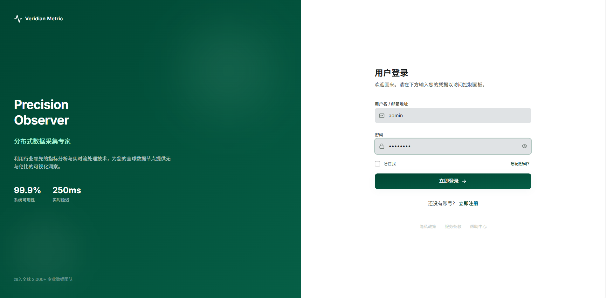
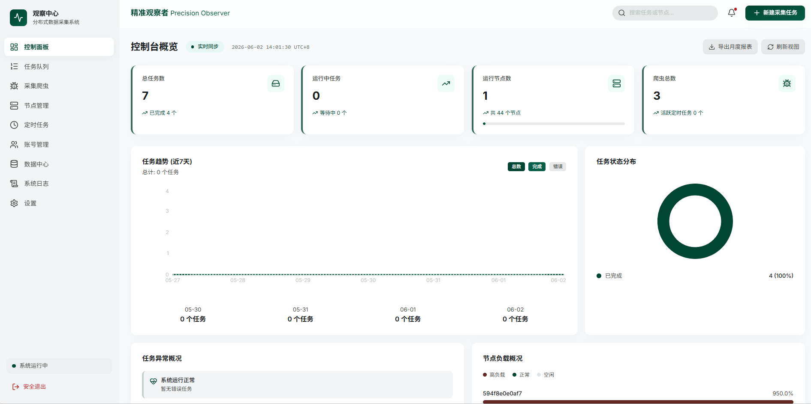
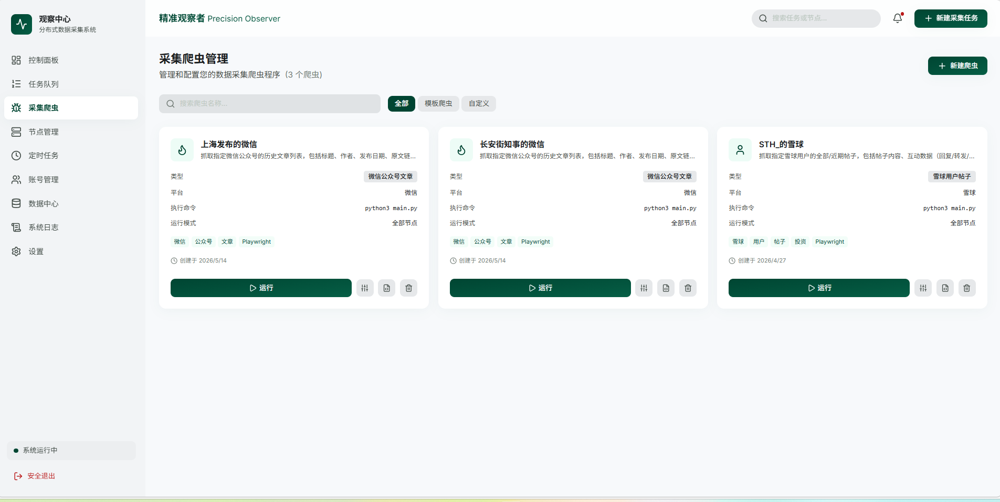
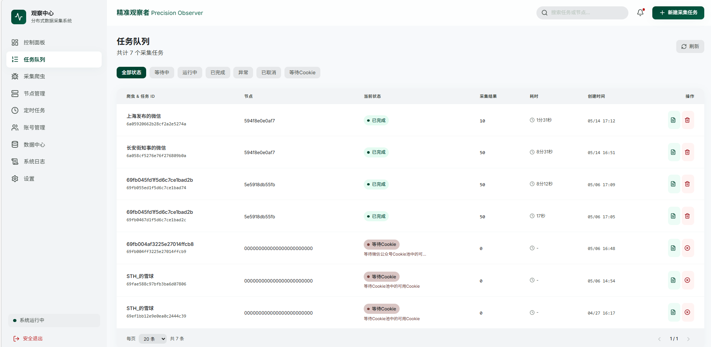
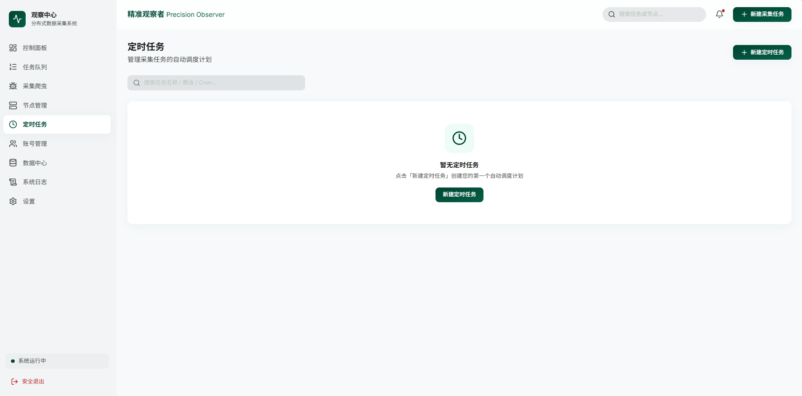
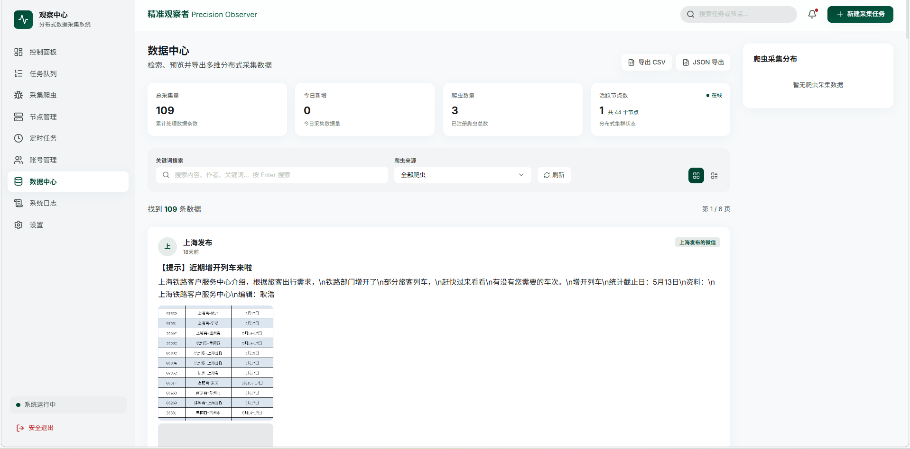
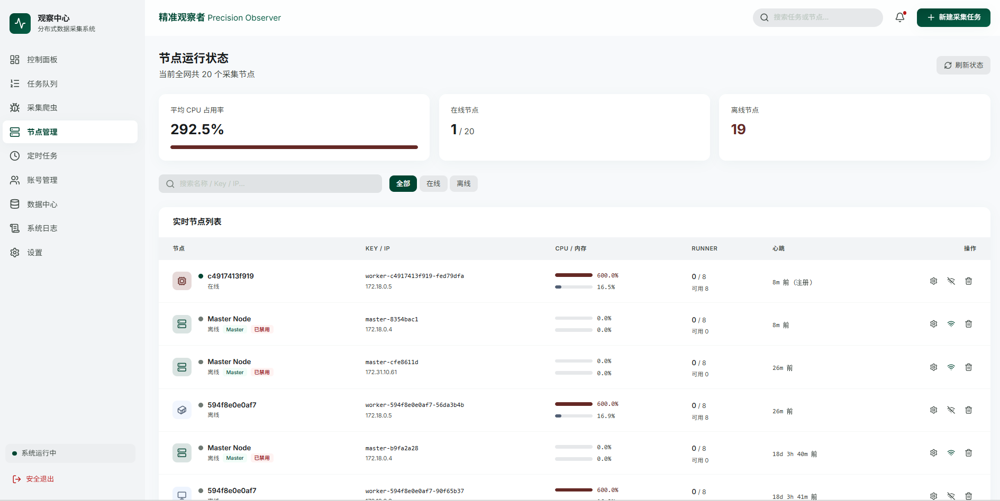
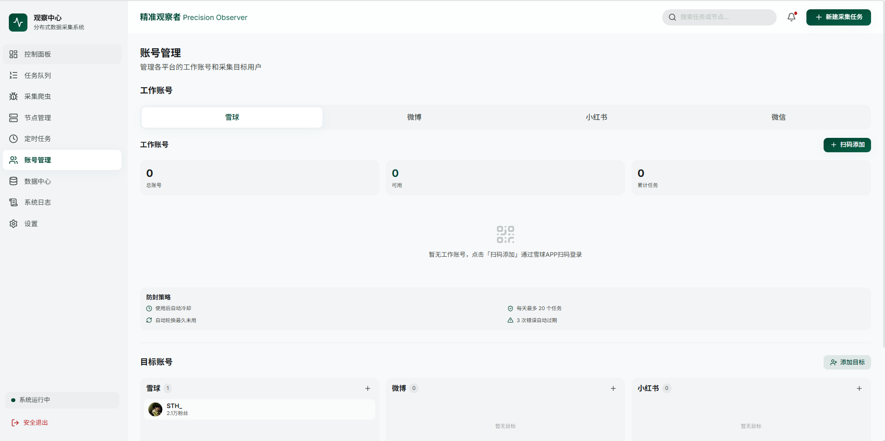
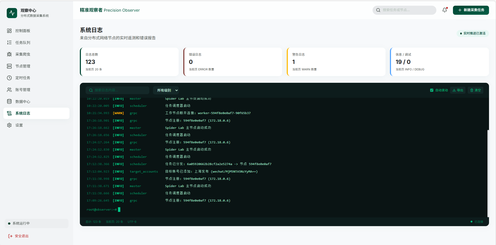
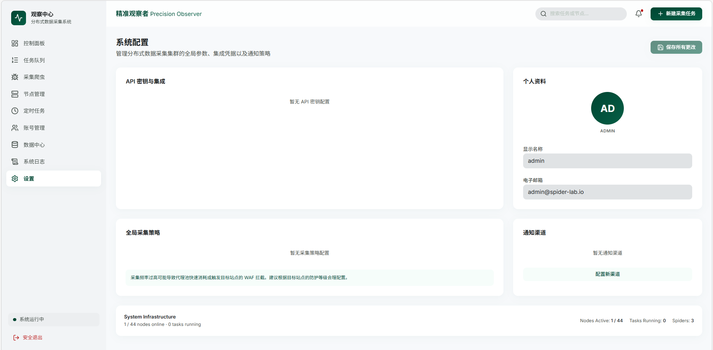

<p align="center">
  <strong>Spider Lab</strong> &mdash; Precision Observer
</p>

<p align="center">
  Distributed web crawler management platform with Master/Worker architecture.
  <br/>
  分布式网络爬虫管理平台，采用 Master/Worker 架构。
</p>

---

**[English](#english)** | **[中文](#中文)**

---

## English

### Overview

Spider Lab (codename **Precision Observer / Veridian Metric**) is a distributed web crawler management platform built for teams that need to collect, schedule, and manage large-scale web scraping tasks across multiple worker nodes. It provides a modern dashboard for real-time monitoring, spider management, task scheduling, data browsing, and multi-platform account management.

### Screenshots

| Login | Dashboard |
|:---:|:---:|
|  |  |

| Spider Manager | Task Queue |
|:---:|:---:|
|  |  |

| Scheduled Tasks | Data Center |
|:---:|:---:|
|  |  |

| Node Management | Account Management |
|:---:|:---:|
|  |  |

| System Logs | Settings |
|:---:|:---:|
|  |  |

### Features

- **Control Plane Dashboard** -- Real-time overview of tasks, nodes, spiders, and system health with trend charts and status distribution.
- **Spider Management** -- Create, configure, and manage spiders with support for both pre-built templates and custom user-uploaded code.
- **Task Queue** -- Monitor all crawling tasks with status filtering (pending, running, completed, error, cancelled, waiting for cookie).
- **Scheduled Tasks** -- Cron-based automatic scheduling for recurring data collection.
- **Node Management** -- Monitor distributed worker nodes in real-time, including CPU/memory usage, heartbeat status, and runner capacity.
- **Account Management** -- Multi-platform account pool (Xueqiu, Weibo, Xiaohongshu, WeChat) with anti-ban strategies (auto-cooldown, rotation, error-based expiry) and target account tracking.
- **Data Center** -- Browse, search, and export collected data (CSV/JSON) with keyword and source filtering.
- **System Logs** -- Real-time log streaming with level filtering, auto-scroll, and export capabilities.
- **Settings** -- API key management, user profile, global collection strategy, and notification channel configuration.

### Architecture

```
                    ┌─────────────┐
                    │   Frontend   │  React + TypeScript + Tailwind CSS
                    │   :3000      │
                    └──────┬──────┘
                           │ REST API
                    ┌──────▼──────┐
                    │   Master     │  Go + Gin + MongoDB
                    │   :8080      │  Scheduler, Deployer, API
                    │   :9666 gRPC │
                    └──┬───┬───┬──┘
                       │   │   │  gRPC
                 ┌─────▼┐ ┌▼───▼─┐
                 │Worker │ │Worker │ ...  Go + Python + Playwright
                 │  #1   │ │  #2   │
                 └───────┘ └───────┘
                       │       │
                    ┌──▼───────▼──┐
                    │   MongoDB    │  Task state, spider configs, data
                    │   :27017     │
                    └─────────────┘
                    ┌─────────────┐
                    │    MinIO     │  Object storage for spider files
                    │   :9000     │
                    └─────────────┘
```

### Tech Stack

| Layer | Technology |
|-------|-----------|
| Backend | Go 1.22, Gin, gRPC, MongoDB 7, MinIO |
| Frontend | React 18, TypeScript, Vite, Tailwind CSS v4 |
| Charts | Recharts |
| State Management | @tanstack/react-query |
| Routing | react-router-dom v6 |
| Auth | JWT + bcrypt |
| Deployment | Docker, docker-compose |

### Quick Start

#### Docker (Recommended)

```bash
docker-compose up --build
```

This starts all services:
- **Frontend**: http://localhost:3000
- **Master API**: http://localhost:8080
- **MongoDB**: localhost:27017
- **MinIO Console**: http://localhost:9001

Default credentials: `admin` / `admin123`

#### Using the Management Script

```bash
# Build everything (backend + frontend)
./spider-lab.sh build

# Start all services (mongo, master, worker, frontend)
./spider-lab.sh start

# Check status
./spider-lab.sh status

# Tail logs
./spider-lab.sh logs          # all services
./spider-lab.sh logs master   # single service

# Stop all services
./spider-lab.sh stop
```

#### Manual Build

**Backend** (requires Go 1.22+):

```bash
cd backend
go build -o bin/master ./cmd/master
go build -o bin/worker ./cmd/worker

# Run master
MASTER_PORT=8080 GRPC_PORT=9090 MONGO_URI=mongodb://localhost:27017 JWT_SECRET=secret ./bin/master

# Run worker
MASTER_ADDR=localhost:9090 WORKER_KEY=worker-key-1 ./bin/worker
```

**Frontend** (requires Node.js):

```bash
cd frontend
npm install
npm run dev      # Development server on :3000
npm run build    # Production build -> dist/
```

### Spider Template System

Spider Lab supports two types of spiders:

- **Template spiders** -- Pre-built, configurable crawlers (e.g. Weibo hot topics, WeChat article history, Xueqiu user posts). Users select a template, fill in configuration fields, and Spider Lab handles code generation and deployment.
- **Custom spiders** -- User-uploaded Python/Node.js code deployed to worker nodes.

**Flow**: Select template -> Configure parameters -> Code + `config.json` generated -> Deployed to worker via gRPC -> Worker installs dependencies (pip + Playwright) -> Executes.

### Worker Setup (Bare Metal)

For non-Docker deployments:

```bash
sudo ./scripts/setup-worker.sh
```

Supports Ubuntu/Debian, CentOS/RHEL/Fedora, Alpine, and macOS. Installs Python 3, Node.js, Go, Playwright + Chromium.

### Project Structure

```
spider-lab/
├── backend/               # Go backend (Master + Worker)
│   ├── cmd/
│   │   ├── master/        # Master node entry point
│   │   └── worker/        # Worker node entry point
│   ├── internal/
│   │   ├── config/        # Configuration
│   │   ├── master/        # API, gRPC server, scheduler, deployer
│   │   ├── models/        # MongoDB models
│   │   ├── utils/         # Shared utilities
│   │   └── worker/        # gRPC client, handler, runner
│   ├── pkg/sdk/           # Public SDK
│   └── proto/             # Protobuf definitions
├── frontend/              # React + TypeScript + Tailwind CSS
│   └── src/
│       ├── components/    # Layout, shared components
│       ├── lib/           # API client (axios)
│       ├── pages/         # Route pages
│       └── types/         # TypeScript interfaces
├── scripts/
│   └── setup-worker.sh   # Worker runtime installer
├── docker-compose.yml     # Full stack Docker deployment
└── spider-lab.sh          # Service management script
```

### License

This project is for private use.

---

## 中文

### 概述

Spider Lab（代号 **精准观察者 / Veridian Metric**）是一个分布式网络爬虫管理平台，专为需要跨多个工作节点进行大规模网页数据采集、调度和管理的团队而设计。平台提供现代化的控制面板，支持实时监控、爬虫管理、任务调度、数据浏览以及多平台账号管理。

### 界面截图

| 登录页 | 控制台 |
|:---:|:---:|
|  |  |

| 爬虫管理 | 任务队列 |
|:---:|:---:|
|  |  |

| 定时任务 | 数据中心 |
|:---:|:---:|
|  |  |

| 节点管理 | 账号管理 |
|:---:|:---:|
|  |  |

| 系统日志 | 系统设置 |
|:---:|:---:|
|  |  |

### 功能特性

- **控制台概览** -- 实时展示任务数、节点状态、爬虫数量和系统健康状况，包含趋势图表和任务状态分布。
- **爬虫管理** -- 创建、配置和管理爬虫，支持预置模板爬虫和用户自定义上传代码。
- **任务队列** -- 监控所有采集任务，支持按状态筛选（等待中、运行中、已完成、异常、已取消、等待Cookie）。
- **定时任务** -- 基于 Cron 表达式的自动调度，实现定期数据采集。
- **节点管理** -- 实时监控分布式工作节点，包括 CPU/内存占用、心跳状态和 Runner 容量。
- **账号管理** -- 多平台账号池（雪球、微博、小红书、微信），内置防封策略（使用后自动冷却、自动轮换最久未用、错误自动过期），支持目标账号追踪。
- **数据中心** -- 浏览、搜索和导出采集数据（CSV/JSON），支持关键词和来源筛选。
- **系统日志** -- 实时日志流，支持按级别筛选、自动滚动和导出功能。
- **系统设置** -- API 密钥管理、个人资料、全局采集策略和通知渠道配置。

### 系统架构

```
                    ┌─────────────┐
                    │   前端界面    │  React + TypeScript + Tailwind CSS
                    │   :3000      │
                    └──────┬──────┘
                           │ REST API
                    ┌──────▼──────┐
                    │   主节点      │  Go + Gin + MongoDB
                    │   :8080      │  调度器、部署器、API
                    │   :9666 gRPC │
                    └──┬───┬───┬──┘
                       │   │   │  gRPC
                 ┌─────▼┐ ┌▼───▼─┐
                 │工作节点│ │工作节点│ ...  Go + Python + Playwright
                 │  #1   │ │  #2   │
                 └───────┘ └───────┘
                       │       │
                    ┌──▼───────▼──┐
                    │   MongoDB    │  任务状态、爬虫配置、采集数据
                    │   :27017     │
                    └─────────────┘
                    ┌─────────────┐
                    │    MinIO     │  爬虫文件对象存储
                    │   :9000     │
                    └─────────────┘
```

### 技术栈

| 层级 | 技术 |
|------|-----|
| 后端 | Go 1.22, Gin, gRPC, MongoDB 7, MinIO |
| 前端 | React 18, TypeScript, Vite, Tailwind CSS v4 |
| 图表 | Recharts |
| 状态管理 | @tanstack/react-query |
| 路由 | react-router-dom v6 |
| 认证 | JWT + bcrypt |
| 部署 | Docker, docker-compose |

### 快速开始

#### Docker 部署（推荐）

```bash
docker-compose up --build
```

将启动以下服务：
- **前端界面**: http://localhost:3000
- **Master API**: http://localhost:8080
- **MongoDB**: localhost:27017
- **MinIO 控制台**: http://localhost:9001

默认账号密码：`admin` / `admin123`

#### 使用管理脚本

```bash
# 构建所有组件（后端 + 前端）
./spider-lab.sh build

# 启动所有服务（MongoDB、主节点、工作节点、前端）
./spider-lab.sh start

# 查看状态
./spider-lab.sh status

# 查看日志
./spider-lab.sh logs          # 所有服务
./spider-lab.sh logs master   # 单个服务

# 停止所有服务
./spider-lab.sh stop
```

#### 手动构建

**后端**（需要 Go 1.22+）：

```bash
cd backend
go build -o bin/master ./cmd/master
go build -o bin/worker ./cmd/worker

# 启动主节点
MASTER_PORT=8080 GRPC_PORT=9090 MONGO_URI=mongodb://localhost:27017 JWT_SECRET=secret ./bin/master

# 启动工作节点
MASTER_ADDR=localhost:9090 WORKER_KEY=worker-key-1 ./bin/worker
```

**前端**（需要 Node.js）：

```bash
cd frontend
npm install
npm run dev      # 开发服务器，端口 3000
npm run build    # 生产构建 -> dist/
```

### 爬虫模板系统

Spider Lab 支持两种类型的爬虫：

- **模板爬虫** -- 预置的可配置爬虫（如微博热搜、微信公众号文章历史、雪球用户帖子）。用户选择模板，填写配置参数，系统自动生成代码并部署。
- **自定义爬虫** -- 用户上传 Python/Node.js 代码，部署至工作节点执行。

**流程**：选择模板 -> 配置参数 -> 生成代码 + `config.json` -> 通过 gRPC 部署到工作节点 -> 工作节点安装依赖（pip + Playwright）-> 执行采集。

### 工作节点部署（裸金属）

非 Docker 环境部署：

```bash
sudo ./scripts/setup-worker.sh
```

支持 Ubuntu/Debian、CentOS/RHEL/Fedora、Alpine 和 macOS。自动安装 Python 3、Node.js、Go、Playwright + Chromium。

### 项目结构

```
spider-lab/
├── backend/               # Go 后端（主节点 + 工作节点）
│   ├── cmd/
│   │   ├── master/        # 主节点入口
│   │   └── worker/        # 工作节点入口
│   ├── internal/
│   │   ├── config/        # 配置管理
│   │   ├── master/        # API、gRPC 服务、调度器、部署器
│   │   ├── models/        # MongoDB 数据模型
│   │   ├── utils/         # 共享工具（数据库、JWT、密码、响应）
│   │   └── worker/        # gRPC 客户端、处理器、运行器
│   ├── pkg/sdk/           # 公共 SDK
│   └── proto/             # Protobuf 定义
├── frontend/              # React + TypeScript + Tailwind CSS 前端
│   └── src/
│       ├── components/    # 布局及共享组件
│       ├── lib/           # API 客户端（axios）
│       ├── pages/         # 路由页面
│       └── types/         # TypeScript 类型定义
├── scripts/
│   └── setup-worker.sh   # 工作节点运行时安装脚本
├── docker-compose.yml     # 全栈 Docker 部署
└── spider-lab.sh          # 服务管理脚本
```

### 许可证

本项目仅供私人使用。
